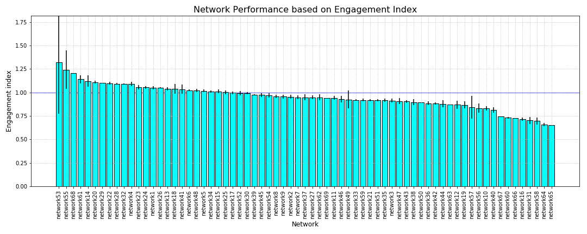
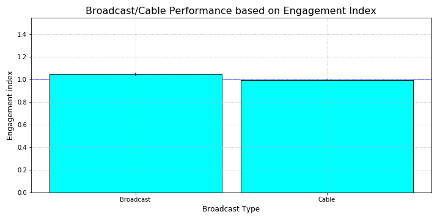
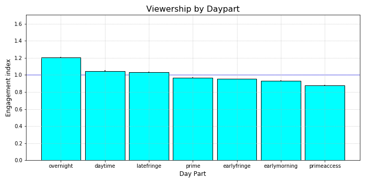
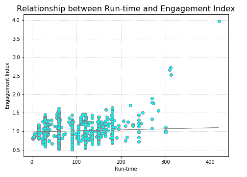

# Television Data Analysis
Television viewership data was evaluated to measure audience engagement. Audience response to certain network, series, or certain time-block is a valuable information as it could be used by media or advertisers to showcase ad. This project first builds a metrics that infer how "engaged" the audiences are. The metrics was then used to compare performance of different network, boardcast type, and time-block. 

## Objectives
1) Develop viewer's engagement index based on Average Percent Viewership (APV). 
2) Visualize performance of Type(broadcast/cable), network, daypart (time block) based on the engagement index

APV = Time viewed(by viewers)/program Runtime

## Method
### Some of the relationships explored:

1) APV vs Run-time: It is understood that APV has strong relationship with Run-time (almost inverse relationship).  
2) APV vs daypart (to understand if time of the day plays an important role in APV) 
3) APV vs network
4) APV vs broadcast/cable

All of the relationships were quickly plotted in excel and JMP was used to understand the significance of the relationships. Out of all the relationships, broadcast/cable impact on APV was not significant (p_value = 0.89).

To find engagement index following steps were followed
a) First relationship between APV and run-time was observed using scatterplot (APV_RunTime sheet in excel). Used trendline and plotted model that has best fit. Logarithmic function had better fit with R2_value of 0.79. 
b) The logarithm function was used to find APV on the curve at a given run time across all series(Presented as APV_logarithm in the analysis_data sheet on the excel file). APV on the curve represents average APV at a given run time across all series. This average APV can be used access whether the series is performing above or below the average. 
c) Finally, to find an index that represents relative performance of the series, APV of a series was divided by average APV for the runtime(APV_logarithm). 

## Result
Used jupyter notebook to demonstrate the performance of different variables based on the engagement index. 

### Network performance
Better performing network is presented by all the bars the crossed blue dotted line

### Broadcast performance
Broadcast is performing slightly better than the average while cable tv is below average

### Time-block importance
Seems unusual but Overnight and latefringe viewer seems to have better viewer engagement than other day-time period

### Is the engagement-index isolated from runtime?
To check if runtime impacts engagement index, Engagement index was plotted against runtime, r_value was calculated using scipy stats. There was no significant relationship between engagement index and runtime with very low r2-value. This indicates that the engagement index is isolated from the runtime.

